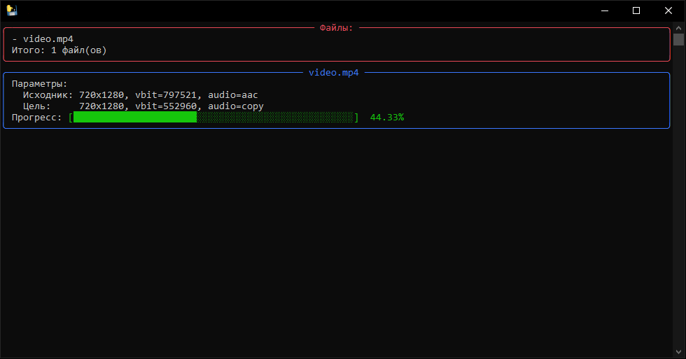

# VideoGymnast

VideoGymnast — утилита для сжатия видео, автоматически рассчитывающая оптимальные аудио/видео‑битрейты для уменьшения размера файлов.

Проект написан на Python и использует ffmpeg для перекодирования, pymediainfo для извлечения метаданных и rich для красивого отображения прогресса в консоли.

## Использование

- Распакуйте архив
- Поместите исходные видео в папку: "Папка программы/input"
- Запустите: VideoGymnast.exe
- Дождитесь завершения процесса обработки и ознакомьтесь с результатами

## Расчёт видео-битрейта

Формула расчёта среднего видео-битрейта: **ширина \* высота \* fps \* коэффициент качества для выходного разрешения**

Коэффициенты качества для разрешений:

- SD = 0.03
- HD = 0.02
- Full HD = 0.01

# Подробности

- Архитектура: [docs/architecture.md](docs/architecture.md)
